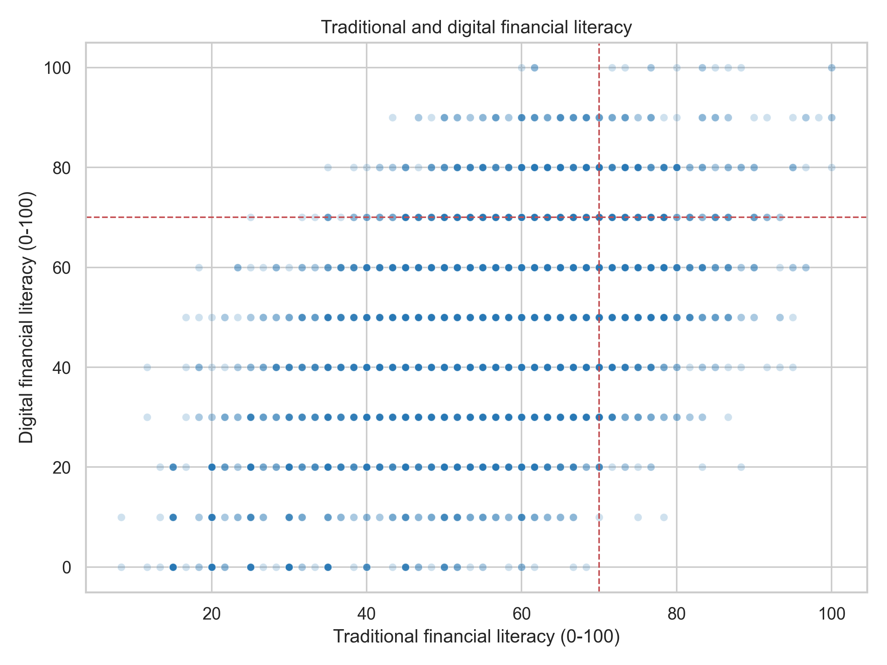
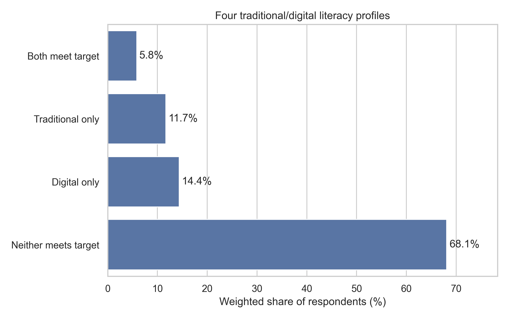
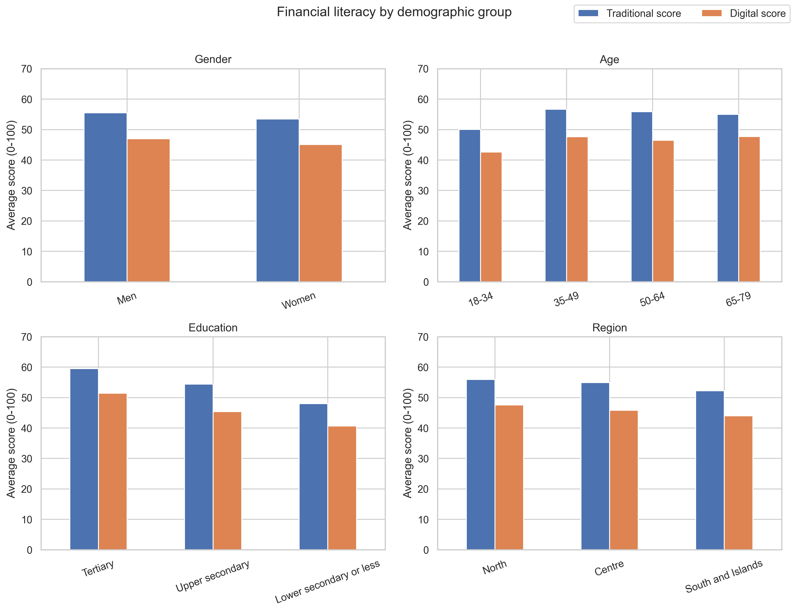
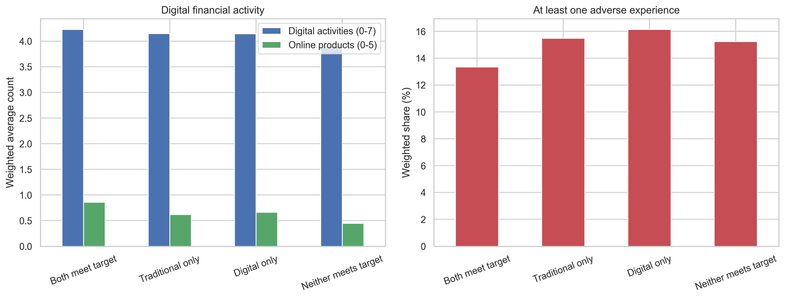

# Traditional and Digital Financial Literacy in Italy

[中文版](README.zh-CN.md)

Should traditional and digital financial literacy be reported as one overall score, or as two separate measures? This Data Science Lab project explores that question using the 2023 Italian IACOFI survey from Banca d'Italia.

The analysis finds that the two dimensions are related, but they identify different groups of people. Reporting them separately, alongside their joint distribution, preserves information that a combined score could hide.

## Data

- **Source:** [Banca d'Italia — Financial literacy of Italian adults](https://www.bancaditalia.it/statistiche/tematiche/indagini-famiglie-imprese/alfabetizzazione/index.html?com.dotmarketing.htmlpage.language=1)
- **Survey:** IACOFI 2023
- **Full sample:** 4,862 Italian residents aged 18–79; 219 variables
- **Comparison sample:** 4,427 respondents with internet access
- **Weighting:** survey weights are used for reported means and percentages

Respondents without internet access are excluded from comparisons of the two scores because the digital module is conditional on internet access. They are not assigned a digital score of zero.

## Analysis

The notebook reconstructs traditional literacy (knowledge, behaviour, and attitudes; 0–20) and digital literacy (the same three components; 0–10), following OECD/INFE scoring rules. It checks the reconstructed means against the official results, converts both totals to a 0–100 scale, and examines:

1. The association between traditional and digital scores.
2. Four profiles defined using a 70% target.
3. Differences by age, gender, education, and region.
4. Digital financial activities, online products, and reported adverse financial experiences.

Python is used throughout, with pandas, NumPy, SciPy, Matplotlib, and Seaborn. The workflow is documented in [project2_analysis.ipynb](project2_analysis.ipynb).

## Main findings

### The scores overlap, but are not interchangeable

The reconstructed weighted means reproduce the published results after rounding: **10.7/20** for traditional literacy and **4.6/10** for digital literacy. Traditional means use the full sample; digital means use internet users.

Among internet users, the Spearman correlation between the two scores is **0.443**. People with similar traditional scores can have quite different digital scores.



### More than a quarter meet only one target

| Profile | Weighted share of internet users |
|---|---:|
| Both meet target | 5.84% |
| Traditional only | 11.70% |
| Digital only | 14.37% |
| Neither meets target | 68.09% |

**26.07% meet exactly one target.** These mixed profiles are the main reason to keep the two dimensions visible: a combined score would not show which area needs attention.



### Education shows the clearest demographic gap

On the 0–100 scale, respondents in the tertiary education group average **59.54** in traditional literacy and **51.42** in digital literacy. Those with lower secondary education or less average **48.03** and **40.64**. Gender and regional differences are smaller. Mixed profiles appear in every age and education group.



### Digital participation and adverse experiences have different patterns

Respondents meeting both targets report an average of **4.23** digital financial activities and **0.86** products obtained online. Those meeting neither report **3.90** activities and **0.45** online products. The traditional-only and digital-only profiles have almost identical activity counts: **4.15** and **4.14**.

The share reporting at least one adverse financial experience ranges from **13.34% to 16.13%** across profiles. These descriptive results do not establish that higher literacy prevents harm. More frequent users may also have more opportunities to encounter problems.



## Conclusion and limits

The results support **reporting traditional and digital financial literacy separately, while presenting them together**. This can help education providers and public institutions distinguish weaknesses in everyday financial skills from weaknesses in digital financial skills.

The study is descriptive and specific to Italy in 2023. It does not establish causal relationships or test whether the same patterns hold in other countries. Behaviour and adverse experiences are self-reported; the 70% threshold simplifies continuous scores; and the digital comparison does not cover people without internet access. The current analysis does not include threshold sensitivity tests or multivariable adjustment.

## Files and reproduction

| File or folder | Contents |
|---|---|
| `project2_analysis.ipynb` | Analysis code, comments, and saved results |
| `data/raw/` | Original survey downloads and extracted data |
| `documentation/` | Official questionnaire, results, and OECD methodology |
| `output/tables/` | Exported analysis tables |
| `output/figures/` | Figures used here and in the report |
| `report.tex` | LaTeX report source |
| `output/pdf/` | Compiled report |
| `SOURCES.md` | Data and documentation links |

Install the analysis packages:

```bash
pip install jupyter pandas numpy scipy matplotlib seaborn
```

Open `project2_analysis.ipynb` from the project folder and select **Restart Kernel and Run All Cells**. The notebook reads `data/raw/stata/Database_ENG.dta` and saves its tables and figures under `output/`.

To compile the report from the same folder, use XeLaTeX:

```bash
latexmk -xelatex -outdir=output/pdf report.tex
```

## Sources and AI assistance

Data belong to Banca d'Italia. Scoring follows the [OECD/INFE 2022 toolkit](https://doi.org/10.1787/cbc4114f-en). See [SOURCES.md](SOURCES.md) and the report for the full references.

OpenAI Codex assisted with code drafting, debugging, documentation, and report preparation. AI assistance is disclosed in the report; the analysis and interpretations require author review before submission.
